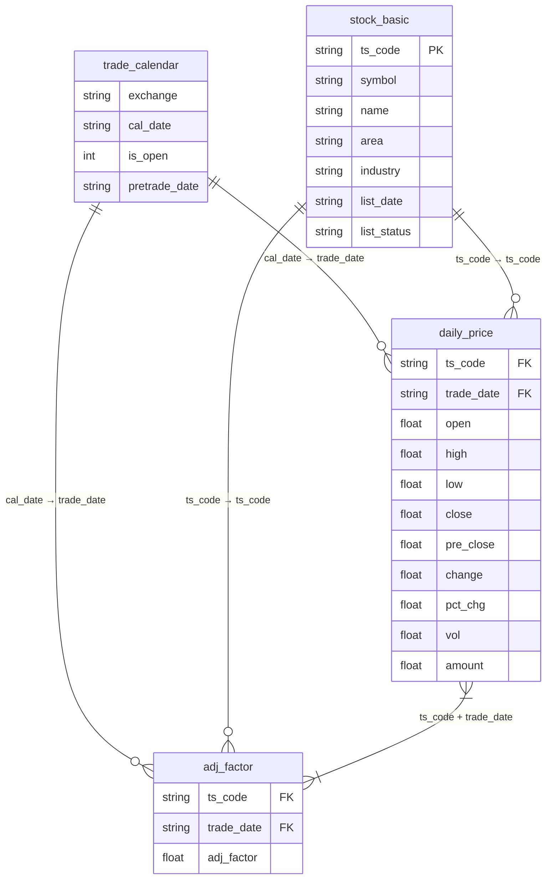

# 1. 表结构分析

根据 `db_based_tushare.py` 代码分析，系统涉及以下4个表：

## 1.1 trade_calendar（交易日历表）
- **来源**：`get_trade_cal()` 方法调用 `pro.trade_cal()` 获取
- **存储策略**：全量替换
- **字段**：
  - exchange: 交易所代码
  - cal_date: 日历日期
  - is_open: 是否开市（0/1）
  - pretrade_date: 上一个交易日

## 1.2 stock_basic（股票基本信息表）
- **来源**：`get_stock_basic()` 方法调用 `pro.stock_basic()` 获取
- **存储策略**：全量替换
- **字段**：
  - ts_code: 股票代码（主键）
  - symbol: 股票代码（数字部分）
  - name: 股票名称
  - area: 所属地域
  - industry: 所属行业
  - list_date: 上市日期
  - list_status: 上市状态（L:上市 P:暂停上市 D:退市）

## 1.3 daily_price（日线行情表）
- **来源**：`frist_download()` 和 `update()` 方法调用 `pro.daily()` 获取
- **存储策略**：增量更新（Upsert）
- **字段**：
  - ts_code: 股票代码（外键）
  - trade_date: 交易日期（外键）
  - open: 开盘价
  - high: 最高价
  - low: 最低价
  - close: 收盘价
  - pre_close: 昨收价
  - change: 涨跌额
  - pct_chg: 涨跌幅（%）
  - vol: 成交量（手）
  - amount: 成交额（千元）

## 1.4 adj_factor（复权因子表）
- **来源**：`frist_download()` 和 `update()` 方法调用 `pro.adj_factor()` 获取
- **存储策略**：增量更新（Upsert）
- **字段**：
  - ts_code: 股票代码（外键）
  - trade_date: 交易日期（外键）
  - adj_factor: 复权因子

# 2. 表关系分析

## 2.1 主键与外键关系
- `stock_basic` 表的 `ts_code` 是主键，关联到 `daily_price` 和 `adj_factor` 表的 `ts_code`
- `trade_calendar` 表的 `cal_date` 关联到 `daily_price` 和 `adj_factor` 表的 `trade_date`
- `daily_price` 和 `adj_factor` 表通过 `ts_code` 和 `trade_date` 联合字段关联

## 2.2 关系类型
- **stock_basic → daily_price**: 一对多（一只股票对应多条日线数据）
- **stock_basic → adj_factor**: 一对多（一只股票对应多条复权因子数据）
- **trade_calendar → daily_price**: 一对多（一个交易日对应多条股票日线数据）
- **trade_calendar → adj_factor**: 一对多（一个交易日对应多条股票复权因子数据）
- **daily_price ↔ adj_factor**: 一对一（同一股票同一交易日对应一条复权因子数据）

# 3. Mermaid E-R图

# 4. 数据流程

1. **首次下载**：
   - 获取股票基本信息 → 全量替换 `stock_basic` 表
   - 获取交易日历 → 全量替换 `trade_calendar` 表
   - 按股票分组获取日线数据 → 增量更新 `daily_price` 表
   - 按日期获取复权因子 → 增量更新 `adj_factor` 表

2. **增量更新**：
   - 计算最新交易日期
   - 获取更新日期范围内的数据
   - 执行与首次下载相同的操作，但仅针对新增日期范围

# 5. 存储策略

- **全量替换**：适用于 `stock_basic` 和 `trade_calendar` 表，确保数据与数据源完全一致
- **增量更新（Upsert）**：适用于 `daily_price` 和 `adj_factor` 表，通过唯一键（ts_code + trade_date）判断是否需要插入新数据

# 6. 设计评估

- **优点**：
  - 表结构清晰，符合业务逻辑
  - 存储策略合理，兼顾数据一致性和性能
  - 关系设计合理，便于数据关联查询

- **改进建议**：
  - 添加索引：对 `daily_price` 和 `adj_factor` 表的 `ts_code` 和 `trade_date` 字段添加联合索引，提高查询效率
  - 增加字段注释：为表和字段添加注释，便于后续维护
  - 考虑分表：对于历史数据量大的表（如 `daily_price`），可考虑按年份或季度分表
